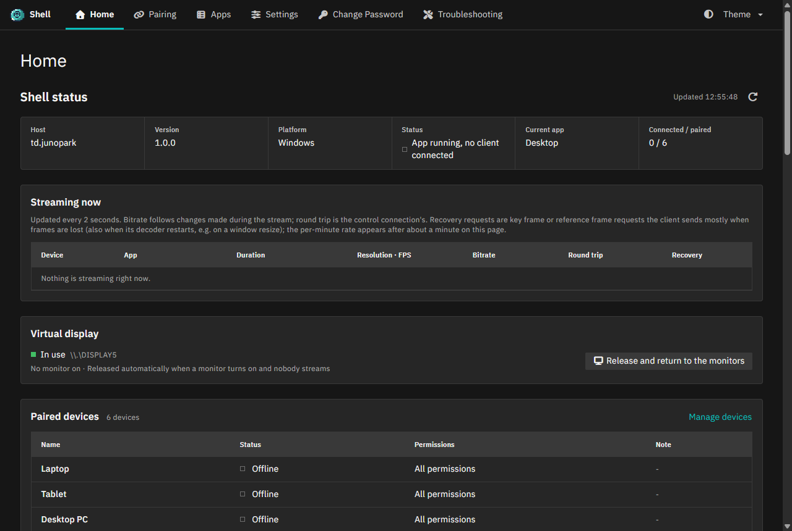
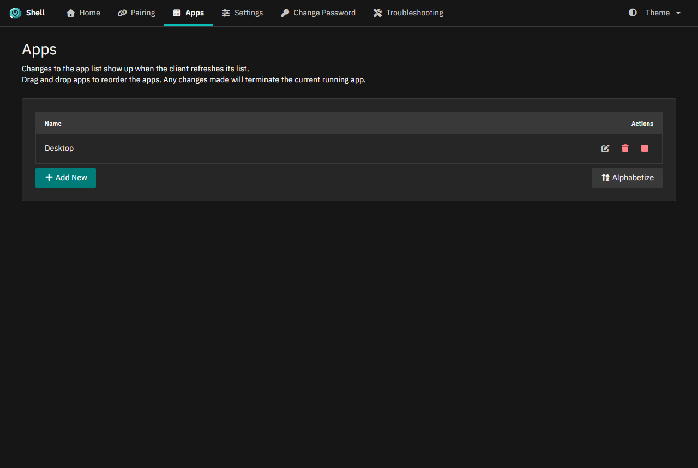
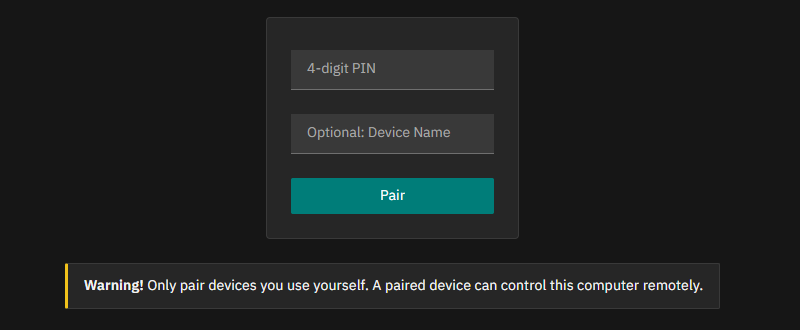

# Shell

**Shell은 Windows용 셀프 호스팅 게임 스트리밍 호스트입니다.** 데스크톱, 게임, 앱 화면을
[Hermit](https://github.com/junopark00/hermit)(Windows)과
[Hermit for Android](https://github.com/junopark00/hermit-android), 그리고
[Moonlight](https://moonlight-stream.org) 같은 GameStream 프로토콜 클라이언트로 스트리밍합니다.

Shell은 [Apollo](https://github.com/ClassicOldSong/Apollo)를 거친 [Sunshine](https://github.com/LizardByte/Sunshine)의
포크입니다. 두 프로젝트의 저지연 스트리밍 엔진을 그대로 쓰면서, 클라이언트에 맞춰지는 가상 디스플레이,
스트리밍 중 비트레이트 변경, 원격 전원 제어, 상태 대시보드, 더 안전한 설치 도구를 더했습니다.

[English](README.md)

| 대시보드 | 앱 | 페어링 |
|---|---|---|
|  |  |  |

## 주요 기능

- **하드웨어 가속 스트리밍**: NVIDIA NVENC, AMD AMF, Intel Quick Sync로 인코딩합니다(GPU가 지원하면
  H.264, HEVC, AV1). 하드웨어 인코더가 없으면 소프트웨어로 인코딩합니다. 지원하는 하드웨어에서는 HDR과
  4:4:4 색 정보도 쓸 수 있습니다.
- **가상 디스플레이**(SudoVDA): 세션마다 클라이언트의 해상도와 주사율에 맞는 디스플레이를 만들 수 있어
  모니터가 없는 PC에서도 동작합니다. 다른 크기로 이어서 접속하면 가상 디스플레이를 그 크기로 바꾸거나
  다시 만들고, 실제 모니터를 켜면 화면을 자동으로 모니터에 돌려줍니다.
- **스트리밍 중 비트레이트 변경**: 스트림을 다시 시작하지 않고 바꿉니다(NVIDIA 인코더).
- **원격 종료와 다시 시작**: 클라이언트에서 PC를 끄거나 다시 시작합니다. 다른 기기가 접속해 있으면 경고합니다.
- **클립보드 동기화**: 텍스트는 양방향, 이미지와 파일은 Hermit에서 주고받습니다.
- **Ctrl+Alt+Del**: 클라이언트에서 보낸 Ctrl+Alt+Del로 Windows 보안 화면을 엽니다(Shell 서비스가 보냄).
- **기기별 권한**: 입력, 클립보드, 파일 전송, 앱 실행, 화면 보기 권한을 기기마다 정합니다.
- **상태 대시보드**: 웹 UI에서 진행 중인 스트림(해상도, 비트레이트, 왕복 지연, 프레임 복구 요청), 페어링된
  기기, 세션 기록, 설치 백업을 한눈에 봅니다.
- **적응형 패킷 전송 속도**: 영상 프레임을 시간에 걸쳐 나눠 보내 인터넷 구간의 몰림 손실을 줄입니다.
- **안전한 설치 도구**: 업데이트할 때마다 설치본 전체를 백업하고, 업데이트가 실패하면 이전 파일을 자동으로
  복원하며, 어떤 백업으로든 명령 하나로 되돌릴 수 있습니다.
- **복구 도구**: 진단 보고서, 설정·페어링·인증서의 암호화 백업과 복원.
- **영어와 한국어** 화면: 웹 UI는 언어 설정을 따르고(업스트림에서 이어받은 다른 언어 번역은 일부만 되어
  있음), 트레이와 알림은 Windows의 시스템 표시 언어가 한국어이면 한국어, 그 밖에는 영어로 나옵니다.

## 호환성

Shell은 모든 GameStream 클라이언트와 함께 쓸 수 있습니다. 일부 기능은 클라이언트의 지원이 필요합니다.

| 기능 | Hermit | Moonlight 등 다른 GameStream 클라이언트 |
|---|---|---|
| 스트리밍, 입력, 게임패드, 오디오, HDR | 지원 | 지원 |
| 클라이언트 해상도의 가상 디스플레이 | 지원 | 지원 |
| 텍스트 클립보드 동기화 | 지원 | Apollo 클립보드 확장을 지원하는 클라이언트 |
| 이미지·파일 클립보드 | 지원 | 미지원 |
| 스트리밍 중 비트레이트 변경 | 지원 | 미지원(다시 연결해 변경) |
| 원격 종료와 다시 시작 | 지원 | 미지원 |
| Ctrl+Alt+Del로 보안 화면 열기 | 지원 | 클라이언트가 키 조합을 보내는 경우 |

Shell은 **Windows 전용**입니다. 업스트림에서 이어받은 Linux와 macOS 코드는 저장소에 남아 있지만 관리하거나
시험하지 않습니다.

## 요구 사항

- Windows 10 또는 Windows 11, 64비트(x64).
- 하드웨어 영상 인코더가 있는 GPU를 강력히 권장합니다: NVIDIA(NVENC), AMD(AMF), Intel(Quick Sync)과 최신
  드라이버. HEVC와 AV1은 해당 코덱을 인코딩하는 GPU가 필요합니다. 하드웨어 인코더가 없으면 소프트웨어
  인코딩을 쓰므로 빠른 CPU가 필요합니다.
- 서비스, 가상 디스플레이 드라이버, 방화벽 규칙을 설치할 관리자 권한.
- 호스트는 유선 네트워크 연결을 권장합니다.

## 설치

1. [최신 릴리스](https://github.com/junopark00/hermit-shell/releases/latest)에서 `Shell-1.1.0.zip`과
   `Install-Shell.ps1`을 같은 폴더에 내려받습니다. ZIP 파일은 풀지 않습니다.
2. 그 폴더에서 **관리자 권한 PowerShell**을 열고 실행합니다.

   ```powershell
   powershell -ExecutionPolicy Bypass -File .\Install-Shell.ps1 -ZipPath .\Shell-1.1.0.zip
   ```

설치 도구는 Shell을 `C:\Program Files\Shell`에 복사하고, SudoVDA 가상 디스플레이 드라이버와 ViGEmBus 가상
게임패드 드라이버를 설치하고, 방화벽 규칙 `Shell`을 추가하고, `ShellService`를 등록해 시작하고, 서비스가
Ctrl+Alt+Del을 보낼 수 있게 합니다. ViGEmBus를 건너뛰려면 `-NoGamepadDriver`를 붙입니다.

Apollo를 쓰고 있었다면 `-MigrateFromApollo`를 붙여 설정, 페어링된 기기, 앱 목록을 Shell로 옮길 수 있습니다.
Apollo는 지우지 않고 사용 안 함으로 바꿉니다. 자세한 내용은 [docs/tools.md](docs/tools.md#migrating-from-apollo)를
참고하세요.

## 처음 실행과 페어링

1. 호스트에서 웹 UI **https://localhost:47990**을 엽니다. 자체 서명 인증서라서 처음에는 브라우저가 경고를
   보여 줍니다. 계속 진행합니다.
2. 관리자 사용자 이름과 비밀번호를 만듭니다.
3. Hermit이나 Moonlight에서 PC를 추가합니다(같은 네트워크라면 보통 자동으로 찾습니다). 클라이언트에 네 자리
   PIN이 나타납니다.
4. 웹 UI의 **페어링** 페이지에 PIN을 입력합니다(Shell 트레이 아이콘의 페어링 알림을 눌러도 됩니다). 알아보기
   쉬운 기기 이름을 붙이고, PIN 옆에서 이 기기의 권한을 고릅니다. **모든 권한**(기본값), **스트리밍과 입력**(앱
   목록·보기·실행과 모든 입력, 클립보드·파일 전송·서버 명령은 제외), **보기만**, 또는 **직접 선택**으로 권한을
   하나씩 켤 수 있습니다. 마지막 선택은 페이지가 기억합니다. 클라이언트는 PIN을 5분 정도 기다립니다. 그 뒤에는
   클라이언트에서 페어링을 다시 시작합니다.

페어링한 기기의 권한은 같은 페이지의 **기기 관리**에서 언제든지 바꿀 수 있습니다. Hermit과 Hermit for Android는
PIN과 기기 이름이 미리 채워진 페어링 페이지를 열어 주므로, 권한만 확인하고 **페어링**을 누르면 됩니다.

## 원격 접속

집 밖에서 스트리밍하려면 클라이언트가 호스트에 연결할 방법이 필요합니다.

- **[Tailscale](https://tailscale.com)(대부분의 경우 권장)**: 호스트와 각 클라이언트 기기에 설치하고 같은
  tailnet에 로그인한 뒤, Hermit에서 호스트를 Tailscale 주소(`100.x.y.z`)나 MagicDNS 이름으로 추가합니다
  (Tailscale로는 자동 검색이 되지 않습니다). 공유기 설정을 바꾸거나 포트를 열 필요가 없고,
  통신사가 CGNAT을 쓰는 환경에서도 동작합니다. Shell은 Tailscale 주소를 같은 네트워크로 보므로 페어링과 웹 UI도
  Tailscale로 쓸 수 있습니다.
- **UPnP**: **설정 > 네트워크 > UPnP**(기본 꺼짐)를 켜면 UPnP를 지원하는 공유기에 스트리밍 포트를 자동으로
  열어 달라고 요청합니다.
- **직접 포트 포워딩**: 호스트의 고정 내부 IP로 TCP 47984, 47989, 48010과 UDP 47998, 47999, 48000을
  포워딩합니다(기본 포트 47989 기준). **웹 UI 포트 47990은 절대 포워딩하지 마세요.**

UPnP와 포트 포워딩은 CGNAT 환경에서는 동작하지 않고, 이 방식을 쓸 때는 집에서 먼저 페어링해야 합니다.
Wake-on-LAN은 대체로 같은 네트워크에서만 동작합니다. 자세한 내용은 [docs/remote-access.md](docs/remote-access.md)를
참고하세요.

## AI 에이전트와 함께 설정하기

[`skills/hermit-shell-setup`](skills/hermit-shell-setup) 폴더에는 AI 에이전트용 Agent Skill이 들어 있습니다.
에이전트가 이 안내를 따라 사용자의 언어로 처음부터 끝까지 설정을 도와줍니다. PC 사양 확인, Shell 설치, 첫 로그인과
Hermit 또는 Hermit for Android 페어링, 원격 접속 방식(Tailscale, UPnP, 포트 포워딩) 선택과 설정, 문제 해결까지
다룹니다.

[Claude Code](https://claude.com/claude-code)에서 쓰려면 호스트로 쓸 PC에서 Claude Code를 실행하고,
`hermit-shell-setup` 폴더를 개인 스킬 폴더 `~/.claude/skills/`(Windows에서는 `%USERPROFILE%\.claude\skills\`)나
Claude Code를 시작하는 폴더의 `.claude/skills/`에 복사합니다. 그다음 Shell을 설정해 달라고 요청하거나
`/hermit-shell-setup`을 입력하면 됩니다(요청이 스킬 설명과 맞으면 Claude가 스킬을 알아서 사용합니다). 자세한 내용은
Claude Code의 [스킬 문서](https://code.claude.com/docs/en/skills)를 참고하세요. 이 스킬은 공개 표준인
[Agent Skills](https://agentskills.io) 형식을 따르므로, 이 형식을 지원하는 다른 에이전트에서도 같은 폴더를 쓸 수 있습니다.

이 스킬은 에이전트에게 단계마다 설명하고 결과를 확인한 뒤 넘어갈 것, PC·공유기·계정에 변화를 주는 일은 먼저 물어볼
것, 비밀번호는 다루지 말 것을 지시합니다. 비밀번호는 사용자가 직접 입력합니다. 공유기 설정은 에이전트가 직접 바꾸지
않고 방법을 안내하며, 웹 UI를 인터넷에 열지 않습니다.

## 설정

모든 설정은 웹 UI의 **설정**에 있습니다. 설정은 `C:\Program Files\Shell\config\shell.conf`에 저장되고, 같은
폴더에 페어링된 기기(`shell_state.json`), 앱 목록(`apps.json`), 로그(`shell.log`)가 있습니다.

Shell에만 있는 설정:

- **영상 패킷 전송 속도(Mbps)** (`video_pacing_mbps`): 한 영상 프레임의 패킷을 보내는 속도입니다. `0`(기본)은
  스트림 비트레이트의 3배(100~800Mbps)를 씁니다. `800`은 업스트림과 같은 동작으로, 손실이 없는 LAN에서 지연이
  가장 짧습니다.
- **모니터를 켜면 가상 디스플레이 해제** (`virtual_display_release_on_monitor`, 기본 켜짐).

각 기능의 자세한 동작은 [docs/features.md](docs/features.md)를 참고하세요.

## 업데이트, 되돌리기, 제거

`Install-Shell.ps1`이 있는 폴더에서 관리자 권한 PowerShell로 실행합니다(설치하는 릴리스의 스크립트를 쓰고,
소스 트리에서는 `shell\Install-Shell.ps1`입니다). PowerShell이 실행을 막으면
`powershell -ExecutionPolicy Bypass -File .\Install-Shell.ps1 ...`로 실행합니다.

```powershell
# 업데이트: 설치본 전체를 백업한 뒤 프로그램 파일만 바꿉니다(설정, 페어링, 드라이버는 유지)
.\Install-Shell.ps1 -ZipPath .\Shell-<version>.zip

# 백업으로 되돌리기(업데이트가 정확한 명령을 출력합니다)
.\Install-Shell.ps1 -Rollback -BackupPath C:\ProgramData\Shell\backups\<폴더>

# 제거. -RemoveDriver는 가상 디스플레이 드라이버와 드라이버 패키지, 인증서도 제거합니다
.\Install-Shell.ps1 -Uninstall -RemoveDriver
```

제거하면 설정과 페어링을 포함한 설치 폴더를 `C:\ProgramData\Shell\backups`로 옮깁니다. 필요 없으면 그 폴더를
지우면 됩니다. 이 폴더는 개인 키 사본을 담고 있어 `config\credentials`와 마찬가지로 Administrators와 SYSTEM만
읽을 수 있습니다.

## 문서

- [기능](docs/features.md): 가상 디스플레이, 전원 제어, 비트레이트 변경, 클립보드, 세션 기록.
- [원격 접속](docs/remote-access.md): Tailscale, UPnP, 포트 포워딩, CGNAT, Wake-on-LAN.
- [도구](docs/tools.md): 설치 도구, 진단과 백업, 연결 점검과 Wake-on-LAN, 스트림 통계.
- [빌드](docs/building.md): 소스에서 Shell 빌드.
- [기여 안내](CONTRIBUTING.md)와 [보안 정책](SECURITY.md).

자세한 문서는 영어로 제공합니다.

## 소스에서 빌드

Shell은 Windows에서 MSYS2(UCRT64)와 공식 Node.js로 빌드합니다.

```powershell
git clone --recurse-submodules https://github.com/junopark00/hermit-shell.git
cd hermit-shell
.\shell\Build-Shell.ps1 -Package
```

휴대용 패키지는 `build\cpack_artifacts\Shell.zip`에 만들어집니다. 준비할 것은
[docs/building.md](docs/building.md)를 참고하세요.

## 개인정보와 네트워크

Shell에는 원격 측정, 사용 통계 수집, 자동 업데이트 확인이 없습니다. 페어링한 클라이언트와 통신하는 것 외에는
다음 경우에만 외부와 통신합니다.

- **게임 커버**: **앱** 페이지에서 커버를 검색하면 브라우저가 LizardByte GameDB(`raw.githubusercontent.com`)에서
  게임 목록을, IGDB(`images.igdb.com`)에서 커버 이미지를 불러옵니다. 커버를 고르면 호스트가 그 이미지를
  IGDB에서 내려받습니다.
- **UPnP**(기본 꺼짐): 켜면 Shell이 공유기에 포트 전달을 요청합니다.

빌드할 때는 웹 UI의 npm 패키지와 GitHub 릴리스의 ViGEmBus 설치 파일을 내려받고, 설치되어 있지 않으면 Boost와
nlohmann/json 소스도 내려받습니다.

## 보안 참고 사항

- **개인 키**: `config\credentials`와 `C:\ProgramData\Shell\backups`의 설치 백업은 Administrators와 SYSTEM만
  읽을 수 있습니다. 이전에 설치한 PC도 업데이트할 때 바로잡습니다.
- **인증서**: SudoVDA 드라이버는 개발자의 자체 서명 인증서로 서명되어 있습니다. Windows가 드라이버를 받아들이도록
  설치 도구가 `sudovda.cer`를 로컬 컴퓨터의 **신뢰할 수 있는 루트 인증 기관**과 **신뢰할 수 있는 게시자** 저장소에
  추가합니다. `Install-Shell.ps1 -Uninstall -RemoveDriver`로 다시 제거할 수 있습니다.
- **원격 종료와 다시 시작**은 기기에 앱 실행 권한이 있어야 합니다. 본인 기기에만 주세요.
- **Ctrl+Alt+Del**: 설치 도구가 서비스가 보안 주의 시퀀스를 보낼 수 있도록 `SoftwareSASGeneration` 정책을
  설정합니다. 제거해도 정책은 남으므로 필요 없으면
  `HKLM\SOFTWARE\Microsoft\Windows\CurrentVersion\Policies\System`에서 지우세요.
- **웹 UI**: 직접 만든 사용자 이름과 비밀번호로 보호되고 HTTPS로 제공되며, 기본적으로 같은 네트워크에서만 접속할
  수 있습니다(사설 주소, 링크 로컬 주소, Tailscale/CGNAT 주소를 같은 네트워크로 봅니다). 이 설정을 유지하고,
  믿을 수 있는 기기만 페어링하세요.
- 취약점은 [SECURITY.md](SECURITY.md)에 따라 비공개로 알려 주세요.

## 라이선스와 감사의 말

Shell은 [GNU General Public License v3.0](LICENSE)을 따르는 자유 소프트웨어입니다.

Shell은 다음 프로젝트의 성과 위에 만들어졌습니다.

- LizardByte와 기여자들의 [Sunshine](https://github.com/LizardByte/Sunshine).
- ClassicOldSong(Yukino Song)과 기여자들의 [Apollo](https://github.com/ClassicOldSong/Apollo).
- Moonlight 프로젝트의 [Moonlight](https://moonlight-stream.org)와 moonlight-common-c.
- SudoMaker의 [SudoVDA](https://github.com/SudoMaker/SudoVDA), Nefarius의 [nefcon](https://github.com/nefarius/nefcon)과 ViGEm.

서드파티 구성 요소와 라이선스는 [NOTICE](NOTICE)에 정리되어 있습니다.

## 고지 사항

Shell은 독립 프로젝트이며 NVIDIA, LizardByte, Moonlight 프로젝트와 제휴하거나 그들의 보증·후원을 받지 않습니다.
GameStream은 NVIDIA Corporation의 상표입니다. 그 밖의 상표는 각 소유자의 것입니다.
